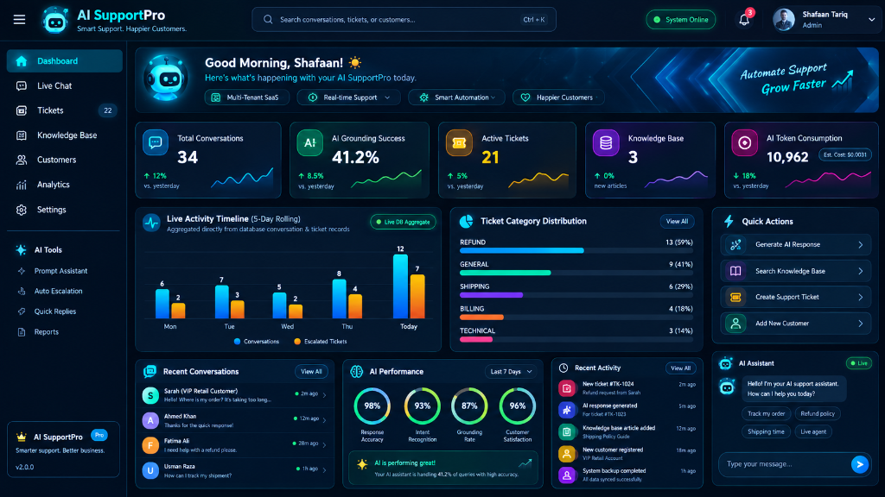

# AI SupportPro

> **Smart Support. Happier Customers.**  
> *Production-Ready, Multi-Tenant AI Customer Support SaaS Platform with Grounded RAG, Verifiable Citations, and Deterministic Human Escalation.*

[](https://opensource.org/licenses/MIT)
[](https://github.com/theclevertrader/ai-supportpro/stargazers)
[](https://github.com/theclevertrader/ai-supportpro/network/members)
[](https://github.com/theclevertrader/ai-supportpro/pulls)
[]()
[]()
[]()
[]()
[]()
[]()

<br />

<div align="center">
  
  
  <br /><br />
  
  ⭐ **If you find AI SupportPro valuable, please star this repository! It helps the project reach more engineers.** ⭐
  
  <br />
  
  [Report Bug](https://github.com/theclevertrader/ai-supportpro/issues) • [Request Feature](https://github.com/theclevertrader/ai-supportpro/issues) • [Documentation](docs/interview-guide.md) • [Contributing](CONTRIBUTING.md)
</div>

---

## 1. Product Overview

**AI SupportPro** is a full-stack, enterprise-grade AI Customer Support SaaS engineered for high-accuracy commercial operations. Instead of behaving like an ungrounded general-purpose chatbot, AI SupportPro strictly adheres to company-authorized documentation via Retrieval-Augmented Generation (RAG).

When customers request refunds, report broken products, ask out-of-scope inquiries, or explicitly ask for human assistance, the platform's deterministic **Escalation Engine** automatically flags the conversation, calculates ticket priority, and generates an actionable support ticket with full context preservation for human support agents.

---

## 2. System Architecture

```
                            +------------------------------------+
                            |       Customer Live Chat Widget    |
                            |  (Embeddable / Standalone Web App) |
                            +-----------------+------------------+
                                              |  Public Widget Key
                                              v
                            +-----------------+------------------+
                            |       Vite 7 + React 19 Frontend |
                            |   React 19 / TypeScript / CSS UI |
                            +-----------------+------------------+
                                              |  REST / SSE API
                                              v
                            +-----------------+------------------+
                            |     FastAPI Backend (Python 3.11)  |
                            |       Modular Monolith Engine      |
                            +-----------------+------------------+
                                              |
               +------------------------------+-------------------------------+
               |                              |                               |
               v                              v                               v
      +------------------+         +--------------------+          +---------------------+
      | Auth & Multi-    |         | RAG & Vector       |          | Deterministic       |
      | Tenancy (RBAC)   |         | Engine (Cosine)    |          | Escalation Engine   |
      +------------------+         +--------------------+          +---------------------+
               |                              |                               |
               +------------------------------+-------------------------------+
                                              |
                                              v
                            +-----------------+------------------+
                            |     PostgreSQL 15 + pgvector       |
                            |   (Dual-Mode SQLite Dev Fallback)  |
                            +-----------------+------------------+
                                              |
                                              v
                            +-----------------+------------------+
                            |   LLM Provider Abstraction Layer   |
                            | OpenAI | Gemini | Anthropic | Mock  |
                            +------------------------------------+
```

---

## 3. Enterprise Features & Bank-Grade Security (10 Pillars)

- **Strict Multi-Tenancy:** Hard database-level tenant isolation using foreign keys and verified JWT claims on every query.
- **Account Lockout Policy:** 5 failed password attempts trigger an automatic 15-minute account freeze defending against distributed botnets.
- **Cryptographic Token Revocation (Logout):** Sliding token blacklist immediately invalidates sessions upon logout to neutralize token replay.
- **Magic-Byte Sniffing & Anti-Polyglot:** Raw file binary header inspection (`%PDF-`, DOS `MZ`, Linux `ELF`) preventing malware masquerading.
- **Deep Stored XSS Sanitization:** Neutralizes script injections, event handlers (`onerror=`), and dangerous DOM elements in all inputs.
- **Immutable Compliance Audit Trail:** Dedicated `audit_logs` table tracking user, action, IP address, and timestamps for SOC2 / ISO 27001.
- **Cryptographic Webhook Signatures:** HMAC SHA-256 constant-time digest verification for Meta WhatsApp Cloud API events.
- **Customer Public Ticket Lookup:** Authenticated portal allowing customers to track ticket progress safely using Ticket ID and email verification.
- **SSRF Hop-by-Hop Defense:** Web import validator strictly blocking loopback (`127.0.0.1`), private subnets, and cloud metadata (`169.254.169.254`).
- **OWASP Hardened Security Headers:** Injects `nosniff`, `SAMEORIGIN`, CSP, and strict referrer policy across all endpoints.
- **Sliding-Window Rate Limiting:** In-memory sliding window protects auth (25 req/min) and general endpoints (200 req/min).
- **Grounded RAG Pipeline & Live SSE Streaming:** Sentence-preserving text chunker, cosine similarity retrieval, and real-time token streaming (`/chat/stream`).
- **Verifiable Citations:** Every AI answer cites the source document and section with percentage match confidence.
- **Deterministic Escalation:** Automatic handoff for disputes, complaints, and low-confidence queries into prioritized support tickets (`LOW`, `MEDIUM`, `HIGH`, `URGENT`).
- **Real-Time Analytics:** Verified, non-fictional metrics covering conversation volume, resolution rates, AI token usage, and costs.
- **Provider Abstraction:** Hot-swappable AI layer supporting OpenAI, Google Gemini, Anthropic, and an offline deterministic Mock provider.
- **Embeddable Website Widget:** Simple `<script>` embed tag requiring only a public `widget_key`.

---

## 4. Quick Start & Local Setup

### Prerequisites
- **Python 3.11+**
- **Node.js 18+ & npm**

### Option A: All-in-One Dev Server (Recommended)
Run both the FastAPI backend and Frontend concurrently with one command:
```bash
python run_dev.py
```
*(On Windows, you can also simply double-click `start_dev.bat`)*

- **Frontend:** `http://localhost:3000`
- **Backend API:** `http://127.0.0.1:8000`
- **Interactive OpenAPI Documentation:** `http://127.0.0.1:8000/docs`

---

### Option B: Separate Terminal Processes

#### 1. Start the Backend API
```bash
cd backend
pip install -r requirements.txt
python -m uvicorn app.main:app --host 127.0.0.1 --port 8000 --reload
```

#### 2. Start the Frontend
```bash
cd frontend
npm install
npm run dev
```
Open `http://localhost:3000` in your browser.

---

## 5. Automated Demo Scenario ("Acme Store")

AI SupportPro includes an automated demo seeder that provisions the complete **"Acme Store"** environment with pre-indexed policies:
1. **Shipping Policy** (Standard 3-5 days, international rates, tracking rules)
2. **Refund Policy** (30-day guarantee, inspection criteria)
3. **Hardware Warranty** (1-year manufacturer warranty, liquid damage exclusions)

### Demo Verification Flows:
- **Scenario A (Grounded Q&A):** Ask `"What is your refund policy?"`  
  -> AI answers citing `Acme Refund & Return Policy - Sec 1`.
- **Scenario B (Auto-Escalation):** Ask `"My item arrived damaged and broken, I want an immediate refund!"`  
  -> AI creates a `HIGH` priority ticket, transitions conversation to `ESCALATED`, and links `Ticket #ID`.
- **Scenario C (Safe Fallback):** Ask `"Do you sell submarine parts in Tokyo?"`  
  -> Low similarity triggers safe non-hallucinatory fallback response with ticket creation.

---

## 6. Automated Testing

Run the test suite covering health, multi-tenancy isolation, prompt injection, RAG citations, and ticket workflows:
```bash
cd backend
python -m pytest tests/ -v
```

Output:
```text
tests/test_backend.py::test_health_check PASSED
tests/test_backend.py::test_seed_demo_tenant_and_login PASSED
tests/test_backend.py::test_customer_chat_and_citations PASSED
tests/test_backend.py::test_customer_escalation_on_refund_complaint PASSED
tests/test_backend.py::test_multi_tenant_isolation PASSED
tests/test_backend.py::test_unknown_question_safety_escalation PASSED
tests/test_backend.py::test_ticket_lifecycle_and_notes PASSED

============================== 7 passed in 5.59s ==============================
```

---

## 7. Docker Deployment

Deploy all services (Frontend, Backend, PostgreSQL with pgvector, and Redis) with a single command:
```bash
docker compose up --build -d
```

---

## 8. License & Commercial Use

Licensed under the MIT License. Ready for freelance commercial deployment and portfolio demonstration.
